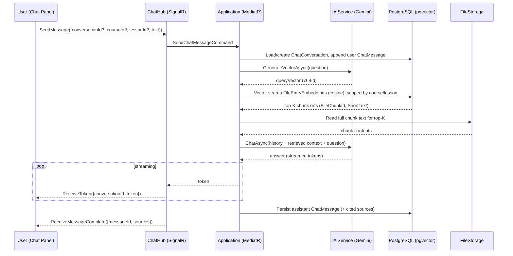

# Feature Plan: AI Learning Assistant Chatbot (RAG)

## 1. Overview

Add an **AI learning assistant chatbox** to CourseMate. A student (or instructor) opens a chat panel — either globally or scoped to a specific course/lesson — and asks questions in natural language. The assistant answers using **Retrieval-Augmented Generation (RAG)** over the lesson material content that is already embedded in the `FileEntryEmbeddings` (pgvector) table, plus the course catalog metadata.

Flow per message:
1. Embed the user question (`IAiService.GenerateVectorAsync`).
2. Vector-search the most relevant document chunks (cosine distance), scoped to the active course/lesson when provided.
3. Build a grounded prompt = retrieved context + recent conversation history + the question.
4. Generate the answer with Gemini (`gemini-2.5-flash`, fallback `gemini-2.5-flash-lite`).
5. Stream the answer to the client over a new **`ChatHub`** (SignalR), and persist both turns.

The chatbox answers **only from retrieved context** ("grounded") and explicitly says when it has no source, to avoid hallucination. Conversations are persisted so the user can resume.

> Scope note: This is the **AI assistant** interpretation of "chatbox" (confirmed). Human-to-human messaging is out of scope for this plan.

---

## 2. Existing Infrastructure (What We Already Have)

| Component | Status | Notes |
|---|---|---|
| `IAiService` (embeddings + content gen) | ✅ Exists | [IAiService.cs](file:///d:/me/projects/CourseMate/CourseMate.Application/Services/AIServices/IAiService.cs) — `GenerateVectorAsync`, `GenerateContentAsync` |
| `GeminiService` (Gemini client, fallback chain) | ✅ Exists | [GeminiService.cs](file:///d:/me/projects/CourseMate/CourseMate.Application/Services/AIServices/GeminiService.cs) — model fallback already implemented |
| `FileEntryEmbedding` (pgvector `vector(768)`) | ✅ Exists | [FileEntryEmbedding.cs](file:///d:/me/projects/CourseMate/CourseMate.Persistent/Entities/FileEntryEmbedding.cs) — has `ShortText`, `FileChunkId`, indices |
| `FileChunk` (chunk text stored in file storage) | ✅ Exists | [FileChunk.cs](file:///d:/me/projects/CourseMate/CourseMate.Persistent/Entities/FileChunk.cs) — full chunk content via `ChunkLocation` |
| Embedding pipeline (chunk → embed → store) | ✅ Exists | [GenerateLessonMaterialEmbeddingJob.cs](file:///d:/me/projects/CourseMate/CourseMate.Application/BackgroundJobs/GenerateLessonMaterialEmbeddingJob.cs) |
| `NotificationHub` / `ContestHub` (SignalR) | ✅ Exists | [Hubs](file:///d:/me/projects/CourseMate/CourseMate.API/Hubs) — JWT-over-querystring already wired in `Program.cs` |
| SignalR client pattern (FE) | ✅ Exists | [useNotifications.ts](file:///d:/me/projects/CourseMate/coursemate-ui/src/hooks/useNotifications.ts) — `HubConnectionBuilder` + `accessTokenFactory` |
| MediatR CQRS + `TransactionPipelineBehavior` | ✅ Exists | Commands write, Queries read; no manual `SaveChangesAsync` |
| `IFileStorageManager` | ✅ Exists | Used to read chunk text back from storage |
| `Pgvector` + `Pgvector.EntityFrameworkCore` | ✅ Referenced | `vector(768)` column mapped; `CosineDistance` available in EF queries |

**Gap (greenfield):** embeddings are written but **never queried**. No vector-search query exists yet — RAG retrieval is built from scratch here.

---

## 3. Architecture Diagram



---

## 4. Implementation Plan

### Phase 1: Backend — Data Model

#### 4.1 New Entity: `ChatConversation`
**File:** `CourseMate.Persistent/Entities/ChatConversation.cs`

```csharp
public class ChatConversation : Entity
{
    public ChatConversation(Guid id, Guid userId, string title, Guid? courseId, Guid? lessonId) : base(id)
    {
        UserId = userId;
        Title = title;
        CourseId = courseId;
        LessonId = lessonId;
    }

    public Guid UserId { get; set; }

    [MaxLength(CourseMateConsts.DefaultMaxLength)]
    public string Title { get; set; }          // Auto from first question

    public Guid? CourseId { get; set; }         // Scope (null = global)
    public Guid? LessonId { get; set; }         // Finer scope (optional)
}
```

#### 4.2 New Entity: `ChatMessage`
**File:** `CourseMate.Persistent/Entities/ChatMessage.cs`

```csharp
public class ChatMessage : Entity
{
    public ChatMessage(Guid id, Guid conversationId, ChatRole role, string content) : base(id)
    {
        ConversationId = conversationId;
        Role = role;
        Content = content;
    }

    public Guid ConversationId { get; set; }
    public ChatRole Role { get; set; }          // User | Assistant

    [MaxLength(CourseMateConsts.ContentMaxLength)]
    public string Content { get; set; }

    // Cited chunk ids serialized as comma-separated string (no JSON in DB per rules)
    [MaxLength(CourseMateConsts.ContentMaxLength)]
    public string? SourceChunkIds { get; set; }
}
```

#### 4.3 New Enum: `ChatRole`
**File:** `CourseMate.Contracts/Enums/ChatRole.cs`

```csharp
public enum ChatRole { User, Assistant }
```

#### 4.4 EF Configurations
**Files:** `CourseMate.Persistent/DbConfigurations/ChatConversationConfiguration.cs`, `ChatMessageConfiguration.cs`

- Plural tables `ChatConversations`, `ChatMessages` (single-line Fluent config per rules).
- `ChatMessage` → `ChatConversation` FK via `HasOne<ChatConversation>().WithMany().HasForeignKey(x => x.ConversationId)`.
- Index `ChatConversation(UserId)`, index `ChatMessage(ConversationId)`.
- No navigation properties (per `RULES.md`).

#### 4.5 DbContext Registration
**Files:** `CourseMateDbContext.cs` **and** `CourseMateReadOnlyDbContext.cs` (both required per rules)

```csharp
public DbSet<ChatConversation> ChatConversations { get; set; }
public DbSet<ChatMessage> ChatMessages { get; set; }
```

#### 4.6 Migration
`dotnet ef migrations add AddChatTables` → creates `ChatConversations`, `ChatMessages`.

---

### Phase 2: Backend — Retrieval Service (the missing vector search)

#### 4.7 New Service: `IChatRetrievalService` / `ChatRetrievalService`
**Files:** `CourseMate.Application/Services/AIServices/IChatRetrievalService.cs` + impl

Responsibility: given a query vector and optional scope, return the top-K most relevant chunks **with full text**.

```csharp
public interface IChatRetrievalService
{
    Task<IReadOnlyList<RetrievedChunk>> RetrieveAsync(
        ReadOnlyMemory<float> queryVector, Guid? courseId, Guid? lessonId, int topK, CancellationToken ct);
}
```

Logic:
1. Build base query over `FileEntryEmbeddings`.
2. If `courseId`/`lessonId` provided: resolve the set of `FileEntryId`s belonging to that course/lesson via `LessonMaterials → Lessons → Chapters → Courses` (single projection query, **no N+1**), filter embeddings to those file entries.
3. Order by `e.Embedding.CosineDistance(new Vector(queryVector))` and `Take(topK)`. (`CosineDistance` from `Pgvector.EntityFrameworkCore`.)
4. Read the full chunk text for the selected `FileChunkId`s via `IFileStorageManager` (fallback to `ShortText` if a chunk file is missing).
5. Return `RetrievedChunk { FileEntryId, FileChunkId, Text, Distance }`.

> This service reads only — but it is invoked from a **Command** handler (chat writes messages), so it may use either context. Put it in `Services/AIServices` and inject the **read-only** context for the vector query to keep retrieval side-effect free.

#### 4.8 Extend `IAiService` with a chat method
**File:** `CourseMate.Application/Services/AIServices/IAiService.cs`

```csharp
IAsyncEnumerable<string> ChatStreamAsync(
    IReadOnlyList<ChatTurn> history, string retrievedContext, string question, CancellationToken ct);
```

- Implement in `GeminiService` using `GenerateContentStreamAsync` with a **grounding system prompt** built by a new `PromptBuilder.BuildChatPrompt(context, question)` that instructs: *answer only from the provided context; if not present, say you don't know; answer in the user's language (Vietnamese-friendly).*
- Implement in `OllamaService` as well (interface parity) or throw `NotSupported` if Ollama is not the active provider.
- Reuse existing fallback model chain (`V25Flash` → `V25FlashLite`).
- **MVP fallback:** if streaming proves complex, ship a non-streaming `ChatAsync(...) : Task<string>` first and stream as a Phase-2 enhancement (see §9).

---

### Phase 3: Backend — Application Layer (CQRS)

| Use case | Type | Handler file |
|---|---|---|
| Send a chat message + get grounded answer | Command | `Commands/Chats/SendChatMessageCommandHandler.cs` |
| Create empty conversation | Command | `Commands/Chats/CreateChatConversationCommandHandler.cs` |
| Delete a conversation | Command | `Commands/Chats/DeleteChatConversationCommandHandler.cs` |
| List my conversations (paged) | Query | `Queries/Chats/GetListChatConversationsQueryHandler.cs` |
| Get conversation messages (paged) | Query | `Queries/Chats/GetChatMessagesQueryHandler.cs` |

**`SendChatMessageCommandHandler`** logic (the core):
1. Resolve `UserId` from `IHttpContextAccessor` (per rules — never from controller).
2. Load conversation (or create one if `ConversationId == null`); validate ownership → `BusinessException` if not owner.
3. Append user `ChatMessage` (`AddAsync`).
4. `GenerateVectorAsync(question)` → query vector.
5. `IChatRetrievalService.RetrieveAsync(...)` → top-K chunks.
6. Load last N (e.g. 6) messages as history.
7. Call `IAiService.ChatStreamAsync(...)`; accumulate the full answer (the **Hub** forwards tokens — see Phase 4).
8. Append assistant `ChatMessage` with `SourceChunkIds`.
9. Set conversation `Title` from first user question if empty.
10. Return `ChatAnswerDto { ConversationId, MessageId, Answer, Sources }`.

Rules compliance: commands use `CourseMateDbContext`, queries use `CourseMateReadOnlyDbContext`; no manual `SaveChangesAsync`; `AddAsync`/`AddRangeAsync`; `EF.Functions.ILike` for any text filter; projections use `private sealed record`; queries never throw and return safe defaults (empty list / null).

---

### Phase 4: Backend — SignalR `ChatHub`

#### 4.9 New Hub: `ChatHub`
**File:** `CourseMate.API/Hubs/ChatHub.cs`

```csharp
[Authorize]
public class ChatHub : Hub
{
    private readonly IMediator _mediator;
    public ChatHub(IMediator mediator) => _mediator = mediator;

    public async Task SendMessage(SendChatMessageRequest request)
    {
        // Stream tokens to caller as the answer is generated, then send completion.
        // Implementation delegates to a streaming command / channel.
        await Clients.Caller.SendAsync("ReceiveStart", request.ConversationId);
        // ... iterate IAsyncEnumerable, SendAsync("ReceiveToken", token) ...
        await Clients.Caller.SendAsync("ReceiveMessageComplete", result);
    }
}
```

For true streaming, prefer SignalR **server-to-client streaming** (`ChannelReader<string>` return / `IAsyncEnumerable`) so the client consumes tokens via `connection.stream("StreamMessage", request)`.

#### 4.10 Register in `Program.cs`
- `app.MapHub<ChatHub>("/hubs/chat").RequireCors("SignalRHubs");`
- Add `/hubs/chat` to the `OnMessageReceived` path check (line ~78) so `access_token` query auth works (same as `/hubs/notification`, `/hubs/contest`).

---

### Phase 5: Backend — REST fallback + history API

#### 4.11 New `ChatController`
**File:** `CourseMate.API/Controllers/ChatController.cs`, `[Route("api/chat")]`

```
POST   /api/chat/messages                  → SendChatMessageCommand (non-stream fallback)
POST   /api/chat/conversations             → CreateChatConversationCommand
GET    /api/chat/conversations             → GetListChatConversationsQuery (paged)
GET    /api/chat/conversations/{id}/messages → GetChatMessagesQuery (paged)
DELETE /api/chat/conversations/{id}        → DeleteChatConversationCommand
```

Thin controllers: MediatR only, `Ok()` / `NoContent()`, follow naming conventions, no try-catch, no business logic (per `RULES.md`).

---

### Phase 6: Frontend — Chat UI

#### 4.12 Service
**File:** `coursemate-ui/src/lib/chat-service.ts` — REST methods (`sendMessage`, `getConversations`, `getMessages`, `createConversation`, `deleteConversation`) via `api-client`.

#### 4.13 Hook: `useChat`
**File:** `coursemate-ui/src/hooks/useChat.ts`

- Build `HubConnection` to `/hubs/chat` (mirror [useNotifications.ts](file:///d:/me/projects/CourseMate/coursemate-ui/src/hooks/useNotifications.ts): `accessTokenFactory`, `withAutomaticReconnect`).
- Consume streamed tokens (`connection.stream(...)` or `on('ReceiveToken')`) and append to the in-progress assistant message.
- Expose `{ messages, sendMessage, isStreaming, conversations, loadConversation, newConversation }`.

#### 4.14 Components (compose shadcn/ui — per UI rules)
**Files under** `coursemate-ui/src/components/(student)/chat/`
- `ChatWidget.tsx` — floating launcher button + panel (`Sheet`/`Popover`).
- `ChatPanel.tsx` — message list + composer (`Textarea` + send `Button`).
- `ChatMessageBubble.tsx` — user vs assistant styling; markdown render; "Sources" disclosure.
- `ChatConversationList.tsx` — history sidebar.

#### 4.15 Integration points
- Global launcher in student layout: `coursemate-ui/src/app/(student)/layout.tsx`.
- Course-scoped: pass `courseId` on course detail / learning pages so retrieval is scoped to that course.
- Lesson-scoped: pass `lessonId` on lesson/learning pages.

Use semantic Tailwind tokens (no raw hex), `next/image` for any avatars, concise UI copy (per `RULE.md`).

---

## 5. DTOs Summary

### New DTOs
| DTO | Location | Purpose |
|---|---|---|
| `SendChatMessageRequest` | `Contracts/DTOs/Chat/SendChatMessageRequest.cs` | Hub/REST request (`ConversationId?`, `CourseId?`, `LessonId?`, `Text`) |
| `ChatAnswerDto` | `Contracts/DTOs/Chat/ChatAnswerDto.cs` | Final answer (`ConversationId`, `MessageId`, `Answer`, `Sources`) |
| `ChatMessageDto` | `Contracts/DTOs/Chat/ChatMessageDto.cs` | One persisted message |
| `ChatConversationDto` | `Contracts/DTOs/Chat/ChatConversationDto.cs` | Conversation summary |
| `ChatSourceDto` | `Contracts/DTOs/Chat/ChatSourceDto.cs` | Cited chunk (`FileChunkId`, `ShortText`, lesson title) |
| `RetrievedChunk` | `Application/Services/AIServices/RetrievedChunk.cs` | Internal retrieval result |
| `ChatTurn` | `Application/Services/AIServices/ChatTurn.cs` | Internal history turn for prompt |

---

## 6. Database Changes

### New Table: `ChatConversations`
| Column | Type | Constraints |
|---|---|---|
| `Id` | `uuid` | PK |
| `UserId` | `uuid` | FK → AspNetUsers, indexed |
| `Title` | `varchar(256)` | NOT NULL |
| `CourseId` | `uuid` | NULLABLE |
| `LessonId` | `uuid` | NULLABLE |
| audit cols | — | `CreationTime`, etc. |

### New Table: `ChatMessages`
| Column | Type | Constraints |
|---|---|---|
| `Id` | `uuid` | PK |
| `ConversationId` | `uuid` | FK → ChatConversations, indexed |
| `Role` | `int` | NOT NULL (`User`/`Assistant`) |
| `Content` | `varchar(4000)` | NOT NULL |
| `SourceChunkIds` | `varchar(4000)` | NULLABLE |
| audit cols | — | — |

> No schema change to `FileEntryEmbeddings` — reused as-is. (Recommended optional follow-up: add an HNSW/IVFFlat index on the `vector` column for retrieval speed at scale; tracked separately since DB tuning changes are restricted by `RULES.md`.)

---

## 7. SignalR Events Reference

### Client → Server
| Method | Payload | Description |
|---|---|---|
| `SendMessage` / `StreamMessage` | `SendChatMessageRequest` | Ask a question; server streams the answer |

### Server → Client
| Method | Payload | Description |
|---|---|---|
| `ReceiveStart` | `{ conversationId }` | Generation started |
| `ReceiveToken` | `{ conversationId, token }` | One streamed token/chunk |
| `ReceiveMessageComplete` | `ChatAnswerDto` | Final message id + cited sources |
| `ReceiveError` | `{ message }` | Retrieval/generation failure |

---

## 8. Testing (per `RULES.md`)

- `Commands/Chats/SendChatMessageCommandHandlerTests.cs`, `CreateChatConversationCommandHandlerTests.cs`, `DeleteChatConversationCommandHandlerTests.cs`.
- `Queries/Chats/GetListChatConversationsQueryHandlerTests.cs`, `GetChatMessagesQueryHandlerTests.cs`.
- Mock `IAiService` and `IChatRetrievalService` (return deterministic vectors/chunks) — tests must not hit Gemini.
- EF InMemory; `TestDbContextScope` already ignores `FileEntryEmbedding` (pgvector). **The actual cosine vector search cannot run on InMemory** → keep vector retrieval inside `ChatRetrievalService` (mocked in handler tests) and cover it with an integration test against a real Postgres+pgvector if/when an integration harness exists.
- Method names `Handle_Should<Expected>_When<Condition>`; assert `BusinessException` + `ErrorCode` on ownership/validation failures.

---

## 9. Implementation Order

```mermaid
gantt
    title Implementation Phases
    dateFormat X
    axisFormat %s
    section Phase 1 - Data Model
    Entities + Enum + EF config + DbContext   :p1a, 0, 2
    Migration                                 :p1b, 2, 3
    section Phase 2 - Retrieval
    IChatRetrievalService (vector search)     :p2a, 3, 5
    IAiService.ChatAsync (non-stream MVP)     :p2b, 5, 6
    section Phase 3 - Application
    Commands + Queries + DTOs                 :p3a, 6, 9
    Unit tests                                :p3b, 9, 10
    section Phase 4 - SignalR
    ChatHub + streaming + Program.cs          :p4a, 10, 12
    section Phase 5 - REST
    ChatController                            :p5a, 12, 13
    section Phase 6 - Frontend
    chat-service + useChat                    :p6a, 13, 15
    Chat components + integration             :p6b, 15, 17
```



**MVP cut line:** Phases 1–3 + REST (Phase 5) + a non-streaming UI gives a working grounded chatbot. SignalR streaming (Phase 4) and conversation history sidebar are enhancements.

---

## 10. File Change Summary

### New Files
| # | File | Layer |
|---|---|---|
| 1 | `Persistent/Entities/ChatConversation.cs` | Entity |
| 2 | `Persistent/Entities/ChatMessage.cs` | Entity |
| 3 | `Contracts/Enums/ChatRole.cs` | Enum |
| 4 | `Persistent/DbConfigurations/ChatConversationConfiguration.cs` | EF Config |
| 5 | `Persistent/DbConfigurations/ChatMessageConfiguration.cs` | EF Config |
| 6 | `Application/Services/AIServices/IChatRetrievalService.cs` (+ impl) | Service |
| 7 | `Application/Services/AIServices/RetrievedChunk.cs`, `ChatTurn.cs` | Internal DTO |
| 8 | `Application/Commands/Chats/SendChatMessageCommandHandler.cs` | Command |
| 9 | `Application/Commands/Chats/CreateChatConversationCommandHandler.cs` | Command |
| 10 | `Application/Commands/Chats/DeleteChatConversationCommandHandler.cs` | Command |
| 11 | `Application/Queries/Chats/GetListChatConversationsQueryHandler.cs` | Query |
| 12 | `Application/Queries/Chats/GetChatMessagesQueryHandler.cs` | Query |
| 13 | `Contracts/DTOs/Chat/*.cs` (5 DTOs) | DTO |
| 14 | `API/Hubs/ChatHub.cs` | SignalR Hub |
| 15 | `API/Controllers/ChatController.cs` | Controller |
| 16 | `coursemate-ui/src/lib/chat-service.ts` | FE service |
| 17 | `coursemate-ui/src/hooks/useChat.ts` | FE hook |
| 18 | `coursemate-ui/src/components/(student)/chat/*.tsx` (4 components) | FE UI |

### Modified Files
| # | File | Change |
|---|---|---|
| 1 | `Application/Services/AIServices/IAiService.cs` | Add `ChatStreamAsync` (+ MVP `ChatAsync`) |
| 2 | `Application/Services/AIServices/GeminiService.cs` | Implement chat generation + `PromptBuilder.BuildChatPrompt` |
| 3 | `Application/Services/AIServices/OllamaService.cs` | Interface parity |
| 4 | `Persistent/CourseMateDbContext.cs` | Add `DbSet`s |
| 5 | `Persistent/CourseMateReadOnlyDbContext.cs` | Add `DbSet`s |
| 6 | `Contracts/Constants/ErrorMessages.cs` | Add `ChatConversationNotFound`, `ChatAccessDenied` error codes |
| 7 | `API/Program.cs` | Map `ChatHub`, add `/hubs/chat` to JWT querystring path check, DI for `IChatRetrievalService` |
| 8 | `Application/ApplicationExtensions.cs` | Register `IChatRetrievalService` |
| 9 | `coursemate-ui/src/app/(student)/layout.tsx` | Mount global `ChatWidget` |

---

## 11. Security & Cost Considerations

1. **Auth**: `ChatHub` and `ChatController` require auth; `UserId` from `IHttpContextAccessor` only.
2. **Ownership**: a user can only read/append to their own conversations → `BusinessException(ChatAccessDenied)`.
3. **Grounding / anti-hallucination**: system prompt forbids answering outside retrieved context; show "Sources" so users can verify.
4. **Scope enforcement**: course/lesson-scoped retrieval prevents leaking content from courses the user shouldn't see (optionally also check enrollment before answering course-scoped questions).
5. **Rate limiting**: throttle `SendMessage` per user (e.g. max 1 in-flight + N/min) to control Gemini cost.
6. **Input size**: cap question length and history window (last 6 turns) to bound token usage.
7. **PII**: do not log full message content at `Information` level; log lengths/ids like existing AI logging.
