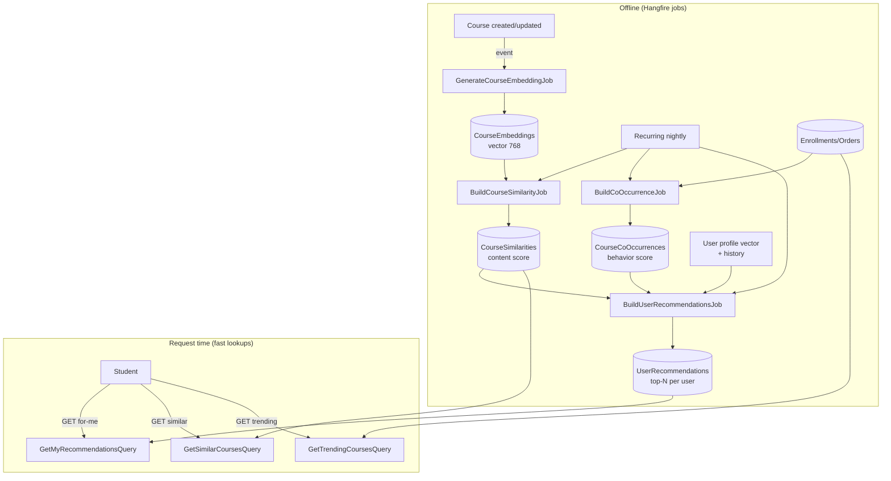

# Feature Plan: Hybrid Course Recommendation System

## 1. Overview

Add a **hybrid recommendation system** that suggests courses to students by combining two signals:

- **Content-based** — semantic similarity between courses using **course-level embeddings** (title + description + category), reusing the existing `IAiService` / pgvector stack.
- **Collaborative (behavioral)** — item-to-item co-occurrence mined from real activity: **enrollments, orders, reviews, lesson progress**.

A weighted **hybrid score** merges both, with business rules (exclude already-owned courses, only `IsPublished`, category boost, popularity prior, recency). Cold-start users fall back to **trending / popular** courses.

Recommendations power three surfaces:
1. **"For You"** — personalized feed on the student home page.
2. **"Similar courses"** — on the course detail page (works for anonymous users too).
3. **"Trending"** — popularity fallback for new/cold users.

Heavy computation runs in **Hangfire background jobs** (already used in this codebase) and is persisted into precomputed tables, so request-time queries are simple, fast lookups (no per-request AI calls, no N+1).

---

## 2. Existing Infrastructure (What We Already Have)

| Component | Status | Notes |
|---|---|---|
| `IAiService.GenerateVectorAsync` | ✅ Exists | [IAiService.cs](file:///d:/me/projects/CourseMate/CourseMate.Application/Services/AIServices/IAiService.cs) — produces `vector(768)` |
| `Pgvector` + EF mapping (`CosineDistance`) | ✅ Exists | [FileEntryEmbeddingConfiguration.cs](file:///d:/me/projects/CourseMate/CourseMate.Persistent/DbConfigurations/FileEntryEmbeddingConfiguration.cs) — pattern to reuse for `CourseEmbedding` |
| `Course`, `Category` entities | ✅ Exists | [Course.cs](file:///d:/me/projects/CourseMate/CourseMate.Persistent/Entities/Course.cs) — `Title`, `Description`, `CategoryId`, `IsPublished`, `Price` |
| Behavioral signals | ✅ Exists | `Enrollment`, `Order`/`OrderItem`, `Review`, `UserLessonProgress` |
| Hangfire background jobs | ✅ Exists | [BackgroundJobs](file:///d:/me/projects/CourseMate/CourseMate.Application/BackgroundJobs) — recurring + enqueue patterns |
| Domain events pipeline | ✅ Exists | [Events](file:///d:/me/projects/CourseMate/CourseMate.Application/Events) — used to trigger embedding jobs |
| Course list/detail queries | ✅ Exists | [Queries/Courses](file:///d:/me/projects/CourseMate/CourseMate.Application/Queries/Courses) — DTO + pagination conventions to mirror |
| `course-service.ts` (FE) | ✅ Exists | [course-service.ts](file:///d:/me/projects/CourseMate/coursemate-ui/src/lib/course-service.ts) — service pattern to extend |

**Gap:** no course-level embeddings, no behavioral mining, no recommendation storage/endpoints. All greenfield, but built on existing primitives.

---

## 3. Architecture Diagram



---

## 4. Scoring Model

For a candidate course `c` relative to user `u`:

```
score(u, c) = w_content * contentSim(profile(u), c)
            + w_behavior * coOccurrence(history(u), c)
            + w_category * categoryAffinity(u, c)
            + w_popularity * normalizedPopularity(c)
            - penalties (already owned, unpublished, same instructor optional)
```

- `profile(u)` = mean of embeddings of courses the user enrolled/bought/rated ≥ 4 (weighted by signal strength).
- `contentSim` = cosine similarity (1 − cosine distance) between `profile(u)` and `CourseEmbedding(c)`.
- `coOccurrence` = sum of co-occurrence weights between `c` and the user's history items (from `CourseCoOccurrences`).
- Default weights (configurable via options): `w_content=0.45, w_behavior=0.35, w_category=0.1, w_popularity=0.1`.
- **Cold start** (no history): drop content/behavior terms → rank by popularity + category interest (if any browsing signal) = Trending.

Weights live in a `RecommendationOptions` bound from config so they can be tuned without code changes.

---

## 5. Implementation Plan

### Phase 1: Backend — Data Model

#### 5.1 New Entity: `CourseEmbedding`
**File:** `CourseMate.Persistent/Entities/CourseEmbedding.cs` (mirror `FileEntryEmbedding`)

```csharp
public class CourseEmbedding : Entity
{
    public CourseEmbedding(Guid id, Guid courseId, Vector embedding) : base(id)
    {
        CourseId = courseId;
        Embedding = embedding;
    }
    public Guid CourseId { get; set; }
    public Vector Embedding { get; set; }   // vector(768)
}
```

#### 5.2 New Entity: `CourseSimilarity` (precomputed content neighbors)
**File:** `CourseMate.Persistent/Entities/CourseSimilarity.cs`

```csharp
public class CourseSimilarity : Entity
{
    public CourseSimilarity(Guid id, Guid courseId, Guid similarCourseId, double score) : base(id) { ... }
    public Guid CourseId { get; set; }
    public Guid SimilarCourseId { get; set; }
    public double Score { get; set; }       // content similarity 0..1
}
```

#### 5.3 New Entity: `CourseCoOccurrence` (precomputed behavioral neighbors)
**File:** `CourseMate.Persistent/Entities/CourseCoOccurrence.cs`

```csharp
public class CourseCoOccurrence : Entity
{
    public Guid CourseId { get; set; }
    public Guid CoCourseId { get; set; }
    public double Weight { get; set; }      // normalized co-occurrence (e.g. cosine / Jaccard)
    public int CoCount { get; set; }        // raw co-enroll/co-purchase count
}
```

#### 5.4 New Entity: `UserRecommendation` (precomputed per-user top-N)
**File:** `CourseMate.Persistent/Entities/UserRecommendation.cs`

```csharp
public class UserRecommendation : Entity
{
    public Guid UserId { get; set; }
    public Guid CourseId { get; set; }
    public double Score { get; set; }
    public int Rank { get; set; }
    public DateTimeOffset GeneratedAt { get; set; }
}
```

#### 5.5 EF Configurations
**Files:** `DbConfigurations/CourseEmbeddingConfiguration.cs`, `CourseSimilarityConfiguration.cs`, `CourseCoOccurrenceConfiguration.cs`, `UserRecommendationConfiguration.cs`

- Plural tables, single-line Fluent config, no navigation properties (per `RULES.md`).
- `CourseEmbedding.Embedding` → `builder.Property(b => b.Embedding).HasColumnType("vector(768)")`.
- FKs: all `*CourseId` → `Courses`; `UserRecommendation.UserId` → `AspNetUsers`.
- Indexes: `CourseSimilarity(CourseId, Score)`, `CourseCoOccurrence(CourseId, Weight)`, `UserRecommendation(UserId, Rank)`, unique `CourseEmbedding(CourseId)`.

#### 5.6 DbContext registration (both contexts) + Migration
Add `DbSet`s to **`CourseMateDbContext`** and **`CourseMateReadOnlyDbContext`**; `dotnet ef migrations add AddRecommendationTables`.

---

### Phase 2: Backend — Course Embedding Pipeline

#### 5.7 `GenerateCourseEmbeddingJob`
**File:** `CourseMate.Application/BackgroundJobs/GenerateCourseEmbeddingJob.cs`

- Input: `courseId`. Build text = `$"{Title}\n{Description}\nCategory: {CategoryName}"`.
- `IAiService.GenerateVectorAsync(text)` → upsert `CourseEmbedding` (delete-and-add or update existing).
- Triggered by a **domain event** on course create/update (mirror `LessonMaterialCreatedEventHandler`): add `CourseSavedEvent` published from `Create/UpdateCourseCommandHandler`.
- Backfill: a one-off admin job to embed all existing published courses.

---

### Phase 3: Backend — Offline Computation Jobs

#### 5.8 `BuildCourseSimilarityJob` (content neighbors)
- For each published course with an embedding, vector-search top-K nearest `CourseEmbeddings` by `CosineDistance` (exclude self), store into `CourseSimilarities` with `Score = 1 - distance`.
- Replace previous rows for that course transactionally.

#### 5.9 `BuildCoOccurrenceJob` (behavioral neighbors)
- Build user→courses sets from `Enrollments` (+ paid `Orders`/`OrderItems`).
- Compute pairwise co-occurrence counts; normalize (cosine over co-counts or Jaccard) → top-K per course into `CourseCoOccurrences`.
- Set-based SQL/LINQ aggregation — **no queries inside loops** (per `RULES.md`); compute in batches.

#### 5.10 `BuildUserRecommendationsJob` (hybrid merge)
- For each active student: build `profile` vector (mean of owned-course embeddings), gather history.
- Candidate generation: union of content-neighbors (`CourseSimilarities`) and behavior-neighbors (`CourseCoOccurrences`) of the user's history; minus owned/unpublished.
- Score each candidate with §4 formula; take top-N (e.g. 30); upsert `UserRecommendations` with `Rank` + `GeneratedAt`.
- Cold-start users (no history) are skipped here and served Trending at query time.

#### 5.11 Recurring registration
- Register the three build jobs as **Hangfire recurring jobs** (e.g. nightly) in `Program.cs` / a startup registrar, alongside event-driven `GenerateCourseEmbeddingJob`.

---

### Phase 4: Backend — Query Layer (request-time, fast)

| Use case | Handler |
|---|---|
| Personalized feed for current user | `Queries/Recommendations/GetMyRecommendationsQueryHandler.cs` |
| Similar courses for a course | `Queries/Recommendations/GetSimilarCoursesQueryHandler.cs` |
| Trending / popular fallback | `Queries/Recommendations/GetTrendingCoursesQueryHandler.cs` |

- All use `CourseMateReadOnlyDbContext`, never throw, return empty list on no data (per rules).
- `GetMyRecommendations`: read `UserRecommendations` for `UserId` (from `IHttpContextAccessor`) joined to `Courses` projection; **if empty → delegate to trending** (cold start).
- `GetSimilarCourses`: read `CourseSimilarities` for `courseId` joined to `Courses`; anonymous-friendly (no auth needed).
- `GetTrendingCourses`: rank published courses by recent enrollment/order counts (windowed) — projection via `private sealed record`, single grouped query, no N+1.
- Reuse the existing course summary DTO shape from `GetListCoursesQuery` for consistency on the FE.

---

### Phase 5: Backend — API

#### 5.12 `RecommendationController`
**File:** `CourseMate.API/Controllers/RecommendationController.cs`, `[Route("api/recommendations")]`

```
GET /api/recommendations/for-me        → GetMyRecommendationsQuery (auth)
GET /api/recommendations/trending      → GetTrendingCoursesQuery (anon ok)
```

Plus on the existing `CourseController`:
```
GET /api/courses/{id}/similar          → GetSimilarCoursesQuery (anon ok)
```

Thin controllers, `Ok()` only, naming conventions (`GetList...`/`GetById...`), no logic.

---

### Phase 6: Frontend

#### 6.1 Service
**File:** `coursemate-ui/src/lib/recommendation-service.ts` — `getForMe()`, `getTrending()`, `getSimilar(courseId)` via `api-client`.

#### 6.2 Components (compose existing course-card UI)
- `RecommendationSection.tsx` ("For You" carousel/grid) — on student home `app/(student)/page.tsx`.
- `SimilarCoursesSection.tsx` — on course detail page.
- `TrendingSection.tsx` — home fallback / landing.
- Reuse existing course card component; Server Component data fetch where possible (per `RULE.md` data-fetching), client component only for interactive carousel.

#### 6.3 Integration
- Home page: show "For You" for authenticated users, "Trending" for guests / cold start.
- Course detail page: append "Similar courses".

---

## 6. DTOs Summary

### New DTOs
| DTO | Location | Purpose |
|---|---|---|
| `RecommendedCourseDto` | `Contracts/DTOs/Recommendations/RecommendedCourseDto.cs` | Course summary + `Score`/`Reason` |
| `RecommendationReason` (enum) | `Contracts/Enums/RecommendationReason.cs` | `BecauseYouTook`, `SimilarContent`, `Popular`, `SameCategory` |
| Internal scoring records | inside handlers/jobs | `private sealed record` projections |

`RecommendedCourseDto` reuses the fields of the existing course list item DTO (Id, Title, ImageUrl, Price, CategoryName, AvgRating) + `Reason`.

---

## 7. Database Changes

| New Table | Key columns | Indexes |
|---|---|---|
| `CourseEmbeddings` | `CourseId`, `Embedding vector(768)` | unique `CourseId` |
| `CourseSimilarities` | `CourseId`, `SimilarCourseId`, `Score` | `(CourseId, Score desc)` |
| `CourseCoOccurrences` | `CourseId`, `CoCourseId`, `Weight`, `CoCount` | `(CourseId, Weight desc)` |
| `UserRecommendations` | `UserId`, `CourseId`, `Score`, `Rank`, `GeneratedAt` | `(UserId, Rank)` |

All FKs to `Courses` / `AspNetUsers`. No DB tuning changes (vector ANN index is an optional follow-up, tracked separately per `RULES.md`).

---

## 8. Testing (per `RULES.md`)

- Query handler tests under `Queries/Recommendations/*` using EF InMemory + `TestDbContextScope` (seed `UserRecommendations`, `CourseSimilarities`, `Courses`).
  - `GetMyRecommendations`: returns ranked list; **falls back to trending when empty** (cold start).
  - `GetSimilarCourses`: ordered by score, excludes self/unpublished.
  - `GetTrendingCourses`: ranking by enrollment counts; pagination.
- Jobs: extract the **scoring/merge logic into pure, testable methods** (no DB) and unit-test the math (profile averaging, hybrid score, co-occurrence normalization). Vector search itself needs Postgres+pgvector (mock or integration only — InMemory ignores `vector`).
- Method names `Handle_Should<Expected>_When<Condition>`; AAA; independent tests.

---

## 9. Implementation Order

```mermaid
gantt
    title Implementation Phases
    dateFormat X
    axisFormat %s
    section Phase 1 - Data Model
    Entities + EF config + DbContext   :p1a, 0, 2
    Migration                          :p1b, 2, 3
    section Phase 2 - Embedding
    GenerateCourseEmbeddingJob + event :p2a, 3, 5
    Backfill existing courses          :p2b, 5, 6
    section Phase 3 - Offline jobs
    BuildCourseSimilarityJob           :p3a, 6, 7
    BuildCoOccurrenceJob               :p3b, 7, 9
    BuildUserRecommendationsJob        :p3c, 9, 11
    Recurring registration             :p3d, 11, 12
    section Phase 4 - Queries
    3 query handlers + DTOs + tests    :p4a, 12, 15
    section Phase 5 - API
    Controllers/endpoints              :p5a, 15, 16
    section Phase 6 - Frontend
    Service + sections + integration   :p6a, 16, 19
```



**Incremental delivery:**
- **M1 (fastest value):** Trending endpoint + "Similar courses" via co-occurrence only (no embeddings) — ships behavioral recs quickly.
- **M2:** add content embeddings + `CourseSimilarities`.
- **M3:** full hybrid `UserRecommendations` "For You" feed.

---

## 10. File Change Summary

### New Files
| # | File | Layer |
|---|---|---|
| 1 | `Persistent/Entities/CourseEmbedding.cs` | Entity |
| 2 | `Persistent/Entities/CourseSimilarity.cs` | Entity |
| 3 | `Persistent/Entities/CourseCoOccurrence.cs` | Entity |
| 4 | `Persistent/Entities/UserRecommendation.cs` | Entity |
| 5 | `Persistent/DbConfigurations/*Configuration.cs` (4 configs) | EF Config |
| 6 | `Application/BackgroundJobs/GenerateCourseEmbeddingJob.cs` | Job |
| 7 | `Application/BackgroundJobs/BuildCourseSimilarityJob.cs` | Job |
| 8 | `Application/BackgroundJobs/BuildCoOccurrenceJob.cs` | Job |
| 9 | `Application/BackgroundJobs/BuildUserRecommendationsJob.cs` | Job |
| 10 | `Application/Events/CourseSavedEventHandler.cs` | Event |
| 11 | `Application/Queries/Recommendations/GetMyRecommendationsQueryHandler.cs` | Query |
| 12 | `Application/Queries/Recommendations/GetSimilarCoursesQueryHandler.cs` | Query |
| 13 | `Application/Queries/Recommendations/GetTrendingCoursesQueryHandler.cs` | Query |
| 14 | `Contracts/DTOs/Recommendations/RecommendedCourseDto.cs` | DTO |
| 15 | `Contracts/Enums/RecommendationReason.cs` | Enum |
| 16 | `Contracts/Options/RecommendationOptions.cs` | Options (weights) |
| 17 | `API/Controllers/RecommendationController.cs` | Controller |
| 18 | `coursemate-ui/src/lib/recommendation-service.ts` | FE service |
| 19 | `coursemate-ui/src/components/(student)/recommendations/*.tsx` (3 sections) | FE UI |

### Modified Files
| # | File | Change |
|---|---|---|
| 1 | `Persistent/CourseMateDbContext.cs` | Add 4 `DbSet`s |
| 2 | `Persistent/CourseMateReadOnlyDbContext.cs` | Add 4 `DbSet`s |
| 3 | `Application/Commands/Courses/CreateCourseCommandHandler.cs` | Publish `CourseSavedEvent` |
| 4 | `Application/Commands/Courses/UpdateCourseCommandHandler.cs` | Publish `CourseSavedEvent` |
| 5 | `API/Controllers/CourseController.cs` | Add `GET /courses/{id}/similar` |
| 6 | `API/Program.cs` | Register recurring Hangfire jobs + bind `RecommendationOptions` |
| 7 | `Application/ApplicationExtensions.cs` | DI for jobs/options if needed |
| 8 | `coursemate-ui/src/app/(student)/page.tsx` | Mount For You / Trending sections |
| 9 | course detail page (FE) | Mount Similar courses section |

---

## 11. Considerations

1. **Cold start**: no-history users → Trending; new courses with no co-occurrence → content-similarity + category surface them.
2. **Freshness vs cost**: precompute nightly; embedding generation is event-driven and incremental, so only changed courses re-embed.
3. **No request-time AI calls**: all Gemini calls happen offline → fast, cheap, resilient endpoints.
4. **Exclusion rules**: never recommend owned/enrolled or unpublished courses; optional de-duplication by instructor/category to keep variety.
5. **Privacy**: recommendations derived from the user's own activity; do not expose other users' identities.
6. **Tunability**: weights via `RecommendationOptions` (config) — adjustable without redeploy logic changes.
7. **Scale**: add an HNSW/IVFFlat ANN index on `vector` columns when course count grows (separate DB-tuning task per `RULES.md`).
8. **Evaluation**: log impressions/clicks on recommended courses later to measure CTR and iterate on weights.
