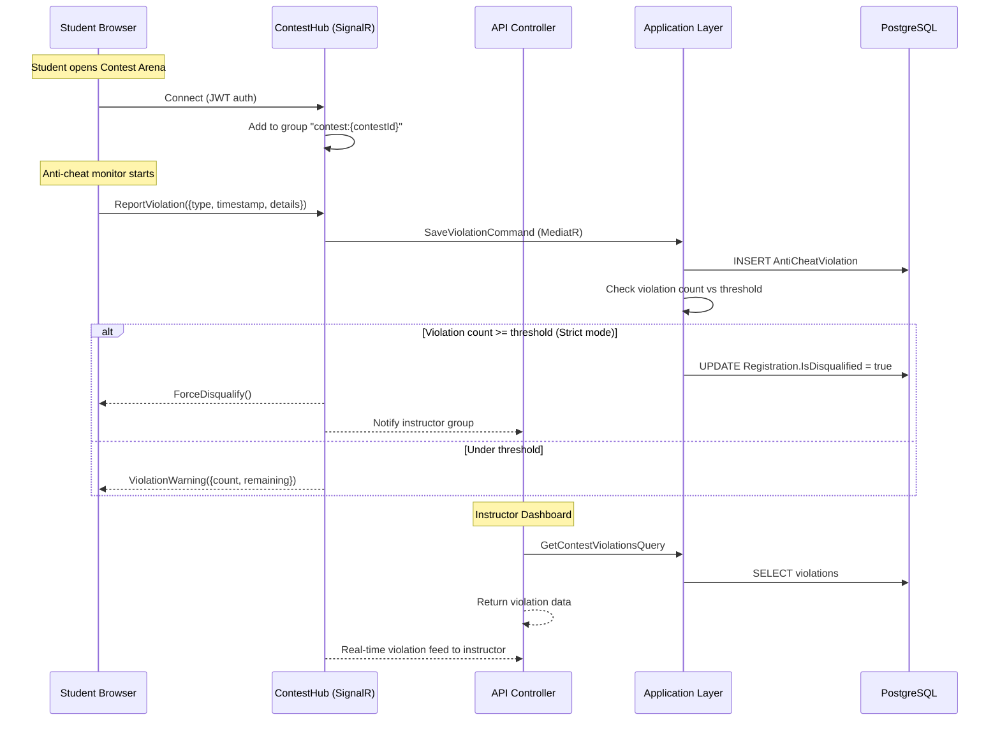

# Feature Plan: Live Coding Cheating Detection

## 1. Overview

Implement a real-time anti-cheat system for the **Contest** module in CourseMate. When a student participates in a coding contest, the frontend monitors suspicious behaviors (tab switching, copy-paste, window blur, right-click, dev tools, screen resize) and reports violations to the backend via **SignalR**. Instructors can monitor violations live on a dashboard and manually disqualify students.

The system operates at three tiers based on the existing `AntiCheatLevel` enum:
- **None** – No monitoring (current behavior).
- **Basic** – Track & log violations; warn the student via toast; notify instructor.
- **Strict** – All of Basic + auto-disqualify after configurable violation threshold.

---

## 2. Existing Infrastructure (What We Already Have)

| Component | Status | Notes |
|---|---|---|
| `AntiCheatLevel` enum (`None`, `Basic`, `Strict`) | ✅ Exists | [AntiCheatLevel.cs](file:///d:/me/projects/CourseMate/CourseMate.Contracts/Enums/AntiCheatLevel.cs) |
| `Contest.AntiCheatLevel` property | ✅ Exists | [Contest.cs](file:///d:/me/projects/CourseMate/CourseMate.Persistent/Entities/Contest.cs#L47) |
| `ContestRegistration.IsDisqualified` flag | ✅ Exists | [ContestRegistration.cs](file:///d:/me/projects/CourseMate/CourseMate.Persistent/Entities/ContestRegistration.cs#L26) |
| `NotificationHub` (SignalR) | ✅ Exists | [NotificationHub.cs](file:///d:/me/projects/CourseMate/CourseMate.API/Hubs/NotificationHub.cs) – Can be extended or a new hub created |
| MediatR CQRS pipeline | ✅ Exists | Commands & Queries pattern throughout |
| Hangfire background jobs | ✅ Exists | For deferred processing |

---

## 3. Architecture Diagram



---

## 4. Implementation Plan

### Phase 1: Backend – Data Model & Core Logic

#### 4.1 New Entity: `AntiCheatViolation`

**File:** `CourseMate.Persistent/Entities/AntiCheatViolation.cs`

```csharp
public class AntiCheatViolation : Entity
{
    public AntiCheatViolation(Guid id, Guid contestId, Guid studentId, 
        string violationType, string? details, DateTimeOffset occurredAt)
        : base(id)
    {
        ContestId = contestId;
        StudentId = studentId;
        ViolationType = violationType;
        Details = details;
        OccurredAt = occurredAt;
    }

    public Guid ContestId { get; set; }
    public Guid StudentId { get; set; }

    [MaxLength(CourseMateConsts.DefaultMaxLength)]
    public string ViolationType { get; set; }  // "TabSwitch", "CopyPaste", etc.

    [MaxLength(CourseMateConsts.DescriptionMaxLength)]
    public string? Details { get; set; }       // Extra metadata (JSON)

    public DateTimeOffset OccurredAt { get; set; }
}
```

#### 4.2 New Enum: `ViolationType`

**File:** `CourseMate.Contracts/Enums/ViolationType.cs`

```csharp
public enum ViolationType
{
    TabSwitch,          // Switched to another tab / alt-tab
    WindowBlur,         // Browser window lost focus
    CopyPaste,          // Paste from clipboard detected
    RightClick,         // Context menu opened
    DevToolsOpen,       // Dev tools detected
    ScreenResize,       // Suspicious window resize
    MultipleMonitors,   // Multiple display detected
    ExternalPaste       // Paste content not from code editor
}
```

#### 4.3 Update `ContestRegistration` Entity

**File:** `CourseMate.Persistent/Entities/ContestRegistration.cs`

Add fields:
```csharp
public int ViolationCount { get; set; }           // Running total
public DateTimeOffset? DisqualifiedAt { get; set; } // When DQ'd (null = not DQ'd)
public string? DisqualifiedReason { get; set; }     // "Auto" or "Manual: <reason>"
```

#### 4.4 Update `Contest` Entity

**File:** `CourseMate.Persistent/Entities/Contest.cs`

Add configurable threshold:
```csharp
public int MaxViolations { get; set; } = 5;  // Violations before auto-DQ (Strict mode)
```

#### 4.5 DbContext Registration

**File:** `CourseMate.Persistent/CourseMateDbContext.cs`

```csharp
public DbSet<AntiCheatViolation> AntiCheatViolations { get; set; }
```

#### 4.6 EF Configuration

**File:** `CourseMate.Persistent/DbConfigurations/AntiCheatViolationConfiguration.cs`

- Configure index on `(ContestId, StudentId)` for fast lookups.
- Configure index on `ContestId` for instructor dashboard queries.

#### 4.7 Migration

Run EF migration to create the new table and add new columns.

---

### Phase 2: Backend – Application Layer (Commands & Queries)

#### 4.8 Command: `ReportViolationCommand`

**File:** `CourseMate.Application/Commands/Contests/ReportViolationCommandHandler.cs`

Logic:
1. Validate the student is registered & not already disqualified.
2. Insert `AntiCheatViolation` record.
3. Increment `ContestRegistration.ViolationCount`.
4. If `AntiCheatLevel == Strict` and `ViolationCount >= Contest.MaxViolations`:
   - Set `IsDisqualified = true`, `DisqualifiedAt = now`, `DisqualifiedReason = "Auto: Exceeded violation threshold"`.
   - Return a result indicating disqualification.
5. Return current violation count and remaining allowed violations.

#### 4.9 Command: `DisqualifyStudentCommand`

**File:** `CourseMate.Application/Commands/Contests/DisqualifyStudentCommandHandler.cs`

Logic:
1. Validate caller is contest creator or Admin.
2. Set `IsDisqualified = true`, `DisqualifiedAt = now`, `DisqualifiedReason = "Manual: {reason}"`.
3. Publish a domain event for real-time notification.

#### 4.10 Query: `GetContestViolationsQuery`

**File:** `CourseMate.Application/Queries/Contests/GetContestViolationsQueryHandler.cs`

Returns all violations for a contest grouped by student. Used by instructor dashboard.

```csharp
public class ContestViolationsDto
{
    public List<StudentViolationSummaryDto> Students { get; set; } = [];
}

public class StudentViolationSummaryDto
{
    public Guid StudentId { get; set; }
    public string StudentName { get; set; }
    public int ViolationCount { get; set; }
    public bool IsDisqualified { get; set; }
    public DateTimeOffset? DisqualifiedAt { get; set; }
    public List<ViolationEntryDto> Violations { get; set; } = [];
}

public class ViolationEntryDto
{
    public Guid Id { get; set; }
    public string ViolationType { get; set; }
    public string? Details { get; set; }
    public DateTimeOffset OccurredAt { get; set; }
}
```

#### 4.11 Query: `GetStudentViolationsQuery`

**File:** `CourseMate.Application/Queries/Contests/GetStudentViolationsQueryHandler.cs`

Returns violations for a specific student in a contest (used by student self-view).

---

### Phase 3: Backend – SignalR Hub

#### 4.12 New Hub: `ContestHub`

**File:** `CourseMate.API/Hubs/ContestHub.cs`

```csharp
[Authorize]
public class ContestHub : Hub
{
    private readonly IMediator _mediator;

    public ContestHub(IMediator mediator)
    {
        _mediator = mediator;
    }

    // Student joins their contest room
    public async Task JoinContest(Guid contestId)
    {
        await Groups.AddToGroupAsync(Context.ConnectionId, $"contest:{contestId}");
        await Groups.AddToGroupAsync(Context.ConnectionId, $"contest:{contestId}:student:{userId}");
    }

    // Student reports a violation
    public async Task ReportViolation(ReportViolationRequest request)
    {
        var result = await _mediator.Send(new ReportViolationCommand { ... });
        
        if (result.IsDisqualified)
        {
            await Clients.Caller.SendAsync("ForceDisqualify", result);
        }
        else
        {
            await Clients.Caller.SendAsync("ViolationWarning", result);
        }

        // Notify instructors watching this contest
        await Clients.Group($"contest:{request.ContestId}:instructors")
            .SendAsync("StudentViolation", new { ... });
    }

    // Instructor joins monitor room
    public async Task JoinContestMonitor(Guid contestId)
    {
        await Groups.AddToGroupAsync(Context.ConnectionId, $"contest:{contestId}:instructors");
    }

    // Instructor manually disqualifies a student
    public async Task DisqualifyStudent(Guid contestId, Guid studentId, string reason)
    {
        var result = await _mediator.Send(new DisqualifyStudentCommand { ... });
        
        // Notify the student
        await Clients.Group($"contest:{contestId}:student:{studentId}")
            .SendAsync("ForceDisqualify", result);
    }
}
```

#### 4.13 Register Hub in `Program.cs`

```csharp
app.MapHub<ContestHub>("/hubs/contest").RequireCors("SignalRHubs");
```

Also update JWT events to accept `access_token` for `/hubs/contest` path.

---

### Phase 4: Backend – API Endpoints

#### 4.14 Update `ContestController`

**File:** `CourseMate.API/Controllers/ContestController.cs`

Add new endpoints:

```
GET  /api/contests/{id}/violations              → Instructor: all violations for a contest
GET  /api/contests/{id}/violations/{studentId}   → Violations for a specific student
POST /api/contests/{id}/disqualify/{studentId}   → Instructor: manually disqualify
POST /api/contests/{id}/reinstate/{studentId}    → Instructor: undo disqualification
```

---

### Phase 5: Frontend – Anti-Cheat Monitor (Student Side)

#### 4.15 Anti-Cheat Hook: `useAntiCheat`

**File:** `coursemate-ui/src/hooks/useAntiCheat.ts`

Core monitoring logic:

```typescript
export function useAntiCheat(contestId: string, antiCheatLevel: AntiCheatLevel) {
  // Returns: { violations, isDisqualified, warningMessage }
  
  // Monitors:
  // 1. document.addEventListener("visibilitychange")  → TabSwitch
  // 2. window.addEventListener("blur")                 → WindowBlur
  // 3. document.addEventListener("paste")              → CopyPaste
  // 4. document.addEventListener("contextmenu")        → RightClick (prevent)
  // 5. window.addEventListener("resize")               → ScreenResize
  // 6. DevTools detection (window.outerWidth - window.innerWidth > threshold)
  // 7. navigator.clipboard monitoring

  // When violation detected:
  // - Send via SignalR: hubConnection.invoke("ReportViolation", {...})
  // - Show toast warning to student
  // - If ForceDisqualify received → redirect to disqualification page
}
```

#### 4.16 Anti-Cheat Warning Modal Component

**File:** `coursemate-ui/src/components/anti-cheat/ViolationWarning.tsx`

- Displays warning count: "⚠️ Warning 2/5: Tab switching detected"
- Progressive severity styling (yellow → orange → red)
- In Strict mode, shows remaining violations before auto-DQ

#### 4.17 Disqualification Screen

**File:** `coursemate-ui/src/components/anti-cheat/DisqualifiedScreen.tsx`

- Full-screen overlay when student is disqualified
- Shows reason and timestamp
- No way to continue the contest

#### 4.18 Integrate into Contest Arena Page

**File:** `coursemate-ui/src/app/(student)/contests/[id]/arena/page.tsx`

- Initialize `useAntiCheat` hook when arena loads
- Connect to `ContestHub` via SignalR
- Wire up `ForceDisqualify` and `ViolationWarning` event handlers
- When `antiCheatLevel === "None"`, skip all monitoring

---

### Phase 6: Frontend – Instructor Monitoring Dashboard

#### 4.19 Live Monitor Page

**File:** `coursemate-ui/src/app/management/contests/[id]/monitor/page.tsx`

Features:
- Real-time violation feed (via SignalR)
- Student list with violation counts and status indicators
- Color-coded rows: 🟢 Clean | 🟡 1-2 violations | 🔴 3+ violations | ⚫ Disqualified
- Click student → expand violation timeline
- "Disqualify" button per student with confirmation modal
- "Reinstate" button for accidentally disqualified students

#### 4.20 Violation Timeline Component

**File:** `coursemate-ui/src/components/anti-cheat/ViolationTimeline.tsx`

- Chronological list of violations for a student
- Each entry: icon + type + timestamp + details
- Visual timeline with markers

#### 4.21 Update Contest Management Detail Page

**File:** `coursemate-ui/src/app/management/contests/[id]/page.tsx`

- Add `MaxViolations` field in contest edit form (visible when `AntiCheatLevel !== None`)
- Add "Live Monitor" button that navigates to monitor page (visible during Ongoing contests)

---

## 5. DTOs Summary

### New DTOs

| DTO | Location | Purpose |
|---|---|---|
| `ReportViolationRequest` | `Contracts/DTOs/AntiCheat/ReportViolationRequest.cs` | SignalR request from student |
| `ViolationResultDto` | `Contracts/DTOs/AntiCheat/ViolationResultDto.cs` | Response after reporting (count, isDisqualified, remaining) |
| `StudentViolationSummaryDto` | `Contracts/DTOs/AntiCheat/StudentViolationSummaryDto.cs` | Per-student summary for instructor |
| `ViolationEntryDto` | `Contracts/DTOs/AntiCheat/ViolationEntryDto.cs` | Single violation record |
| `ContestViolationsDto` | `Contracts/DTOs/AntiCheat/ContestViolationsDto.cs` | All violations for a contest |
| `DisqualifyStudentRequest` | `Contracts/DTOs/AntiCheat/DisqualifyStudentRequest.cs` | Instructor DQ request |

### Updated DTOs

| DTO | Changes |
|---|---|
| `ContestDto` | Add `MaxViolations` field |
| `ContestWorkspaceDto` | Add `AntiCheatLevel`, `MaxViolations`, `ViolationCount`, `IsDisqualified` |
| `CreateContestCommand` | Add `MaxViolations` field |
| `UpdateContestCommand` | Add `MaxViolations` field |
| `LeaderboardEntryDto` | Add `IsDisqualified` field |

---

## 6. Database Changes

### New Table: `AntiCheatViolations`

| Column | Type | Constraints |
|---|---|---|
| `Id` | `uuid` | PK |
| `ContestId` | `uuid` | FK → Contests, NOT NULL |
| `StudentId` | `uuid` | FK → AspNetUsers, NOT NULL |
| `ViolationType` | `varchar(256)` | NOT NULL |
| `Details` | `varchar(2000)` | NULLABLE |
| `OccurredAt` | `timestamptz` | NOT NULL |
| `CreationTime` | `timestamptz` | NOT NULL (audit) |
| `UserId` | `uuid` | NULLABLE (audit) |

**Indexes:**
- `IX_AntiCheatViolations_ContestId_StudentId` (composite)
- `IX_AntiCheatViolations_ContestId` (for dashboard queries)

### Altered Table: `ContestRegistrations`

| New Column | Type | Default |
|---|---|---|
| `ViolationCount` | `int` | `0` |
| `DisqualifiedAt` | `timestamptz` | `NULL` |
| `DisqualifiedReason` | `varchar(500)` | `NULL` |

### Altered Table: `Contests`

| New Column | Type | Default |
|---|---|---|
| `MaxViolations` | `int` | `5` |

---

## 7. SignalR Events Reference

### Client → Server (Student invokes)

| Method | Payload | Description |
|---|---|---|
| `JoinContest` | `{ contestId }` | Join contest SignalR group |
| `ReportViolation` | `{ contestId, violationType, details, timestamp }` | Report a detected violation |

### Server → Client (Student receives)

| Method | Payload | Description |
|---|---|---|
| `ViolationWarning` | `{ violationCount, maxViolations, message }` | Warning after violation logged |
| `ForceDisqualify` | `{ reason, disqualifiedAt }` | Student is disqualified |

### Client → Server (Instructor invokes)

| Method | Payload | Description |
|---|---|---|
| `JoinContestMonitor` | `{ contestId }` | Join instructor monitor group |
| `DisqualifyStudent` | `{ contestId, studentId, reason }` | Manually disqualify |
| `ReinstateStudent` | `{ contestId, studentId }` | Undo disqualification |

### Server → Client (Instructor receives)

| Method | Payload | Description |
|---|---|---|
| `StudentViolation` | `{ studentId, studentName, violationType, violationCount, timestamp }` | Real-time violation event |
| `StudentDisqualified` | `{ studentId, studentName, reason }` | Student was auto/manually DQ'd |
| `StudentReinstated` | `{ studentId, studentName }` | Student was reinstated |

---

## 8. File Change Summary

### New Files (14 files)

| # | File | Layer |
|---|---|---|
| 1 | `Persistent/Entities/AntiCheatViolation.cs` | Entity |
| 2 | `Contracts/Enums/ViolationType.cs` | Enum |
| 3 | `Persistent/DbConfigurations/AntiCheatViolationConfiguration.cs` | EF Config |
| 4 | `Contracts/DTOs/AntiCheat/ReportViolationRequest.cs` | DTO |
| 5 | `Contracts/DTOs/AntiCheat/ViolationResultDto.cs` | DTO |
| 6 | `Contracts/DTOs/AntiCheat/StudentViolationSummaryDto.cs` | DTO |
| 7 | `Contracts/DTOs/AntiCheat/ViolationEntryDto.cs` | DTO |
| 8 | `Contracts/DTOs/AntiCheat/ContestViolationsDto.cs` | DTO |
| 9 | `Application/Commands/Contests/ReportViolationCommandHandler.cs` | Command |
| 10 | `Application/Commands/Contests/DisqualifyStudentCommandHandler.cs` | Command |
| 11 | `Application/Queries/Contests/GetContestViolationsQueryHandler.cs` | Query |
| 12 | `API/Hubs/ContestHub.cs` | SignalR Hub |
| 13 | `coursemate-ui/src/hooks/useAntiCheat.ts` | Frontend Hook |
| 14 | `coursemate-ui/src/app/management/contests/[id]/monitor/page.tsx` | Frontend Page |

### Modified Files (10 files)

| # | File | Change |
|---|---|---|
| 1 | `Persistent/Entities/ContestRegistration.cs` | Add `ViolationCount`, `DisqualifiedAt`, `DisqualifiedReason` |
| 2 | `Persistent/Entities/Contest.cs` | Add `MaxViolations` |
| 3 | `Persistent/CourseMateDbContext.cs` | Add `DbSet<AntiCheatViolation>` |
| 4 | `Contracts/DTOs/ContestDto.cs` | Add `MaxViolations` |
| 5 | `Contracts/DTOs/ContestWorkspaceDto.cs` | Add `AntiCheatLevel`, `MaxViolations`, `ViolationCount`, `IsDisqualified` |
| 6 | `Contracts/DTOs/LeaderboardEntryDto.cs` | Add `IsDisqualified` |
| 7 | `API/Controllers/ContestController.cs` | Add violation & disqualify endpoints |
| 8 | `API/Program.cs` | Register `ContestHub`, update JWT event for `/hubs/contest` |
| 9 | `Application/Commands/Contests/CreateContestCommandHandler.cs` | Map `MaxViolations` |
| 10 | `coursemate-ui/src/app/(student)/contests/[id]/arena/page.tsx` | Integrate `useAntiCheat` hook |

---

## 9. Implementation Order

```mermaid
gantt
    title Implementation Phases
    dateFormat  X
    axisFormat %s

    section Phase 1 - Data Model
    ViolationType enum                 :p1a, 0, 1
    AntiCheatViolation entity          :p1b, 0, 1
    Update Contest entity              :p1c, 0, 1
    Update ContestRegistration entity  :p1d, 0, 1
    EF Configuration                   :p1e, 1, 2
    DbContext registration             :p1f, 1, 2
    EF Migration                       :p1g, 2, 3

    section Phase 2 - Application
    DTOs                               :p2a, 3, 4
    ReportViolationCommand             :p2b, 4, 5
    DisqualifyStudentCommand           :p2c, 4, 5
    GetContestViolationsQuery          :p2d, 5, 6

    section Phase 3 - SignalR Hub
    ContestHub                         :p3a, 6, 8
    Program.cs registration            :p3b, 8, 9

    section Phase 4 - API
    New controller endpoints           :p4a, 9, 10
    Update existing endpoints          :p4b, 9, 10

    section Phase 5 - Frontend Student
    useAntiCheat hook                  :p5a, 10, 12
    Warning & DQ components            :p5b, 12, 13
    Arena integration                  :p5c, 13, 14

    section Phase 6 - Frontend Instructor
    Monitor page                       :p6a, 14, 16
    Contest management updates         :p6b, 16, 17
```



---

## 10. Security Considerations

1. **Rate limiting**: Throttle `ReportViolation` calls to prevent spam (max 1 per second per student).
2. **Server-side validation**: Never trust client-reported violations blindly — validate `contestId` ownership, check contest is `Ongoing`, verify student is registered.
3. **Idempotency**: Deduplicate rapid-fire violations of the same type within a short window (e.g., 3 seconds).
4. **Authorization**: Only contest creators and Admins can view violations and disqualify students.
5. **Audit trail**: All disqualifications (auto and manual) are logged with timestamps and reasons.
6. **SignalR group isolation**: Students can only join their own contest group; instructors verified before joining monitor group.
